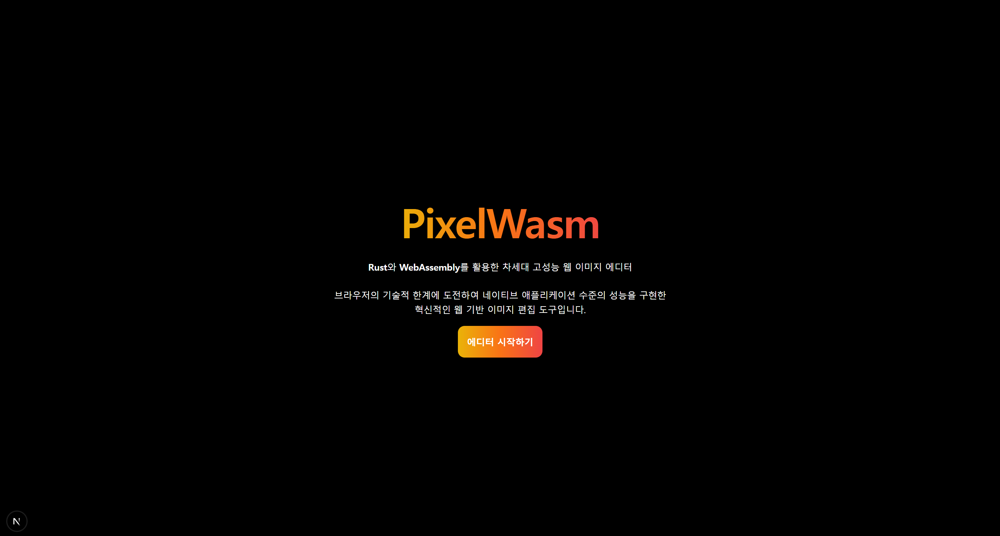
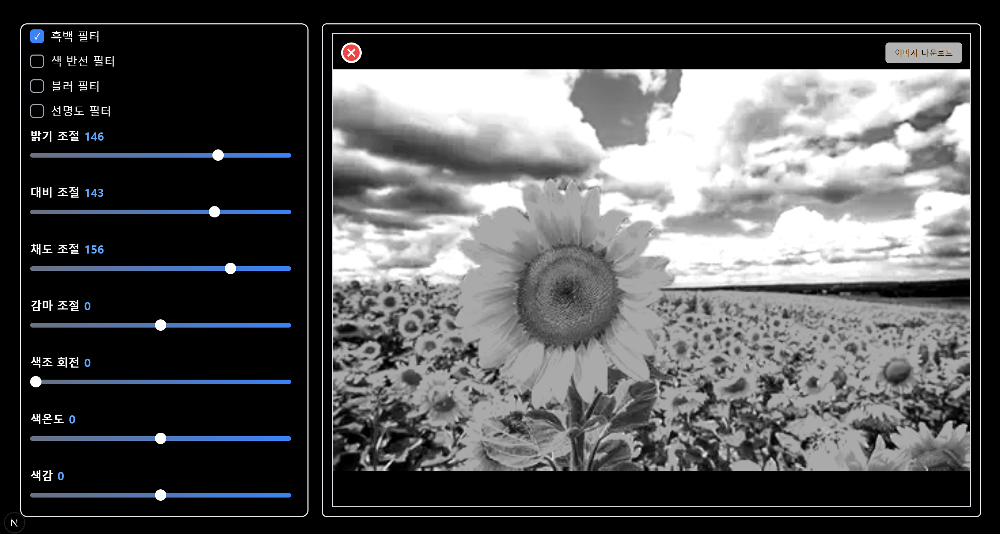
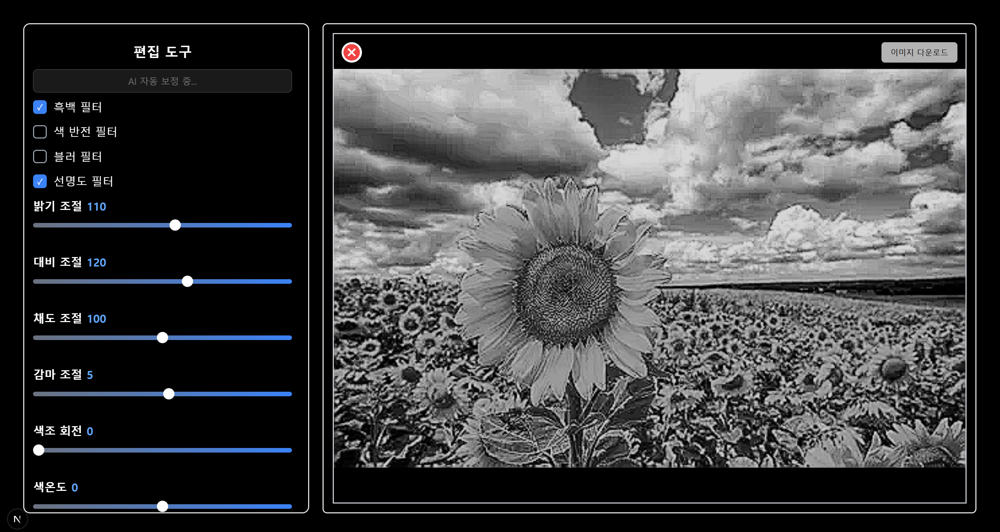
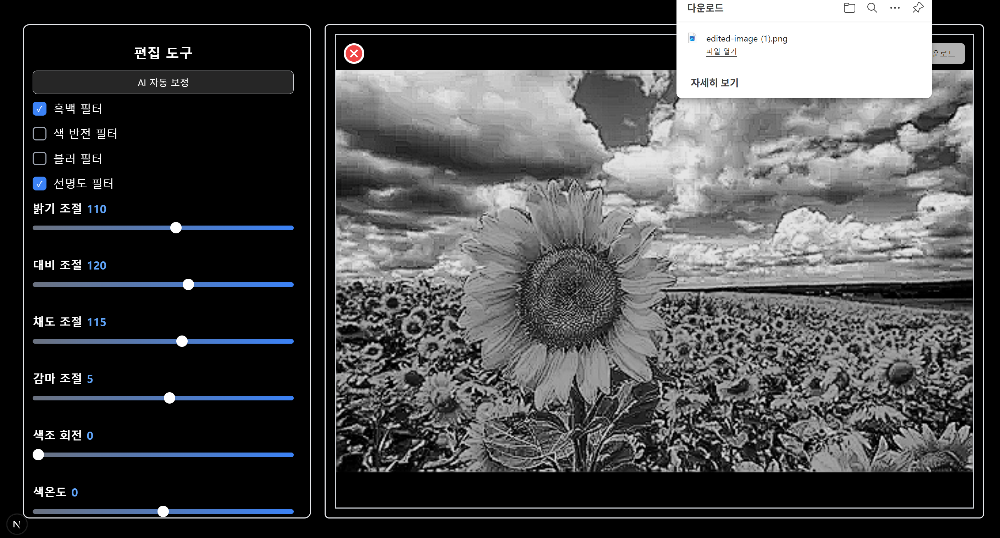
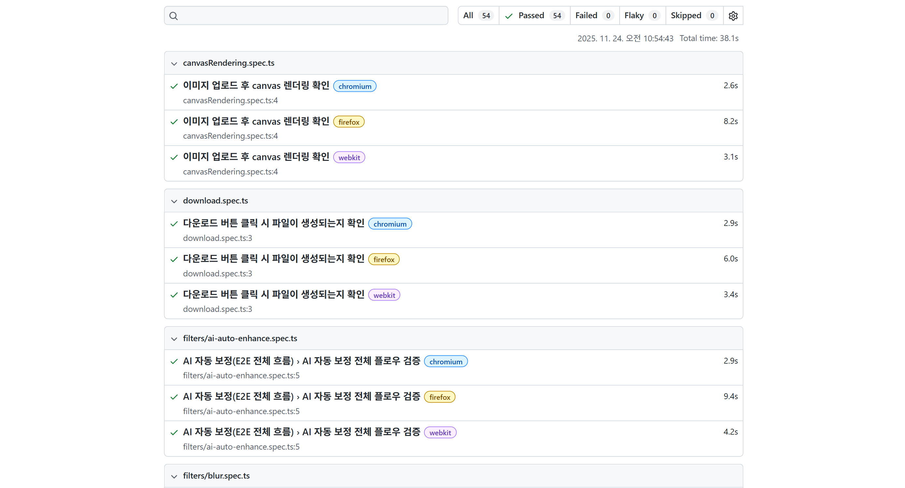

<h1>ImageEditor - 고성능 WebAssembly && AI 기반 웹 이미지 편집기</h1>

<h2>프로젝트 소개</h2>
<strong><a href="https://woowacourse-precourse-image-editor.vercel.app/">배포 링크</a></strong>

Image Editor는 WebAssembly 기반의 필터 엔진과 AI 자동 보정 기능을 갖춘 고성능 웹 이미지 편집기입니다.

<ul>
    <li>Rust → WebAssembly로 변환된 초고속 필터 엔진</li>
    <li>Canvas 기반 실시간 렌더링</li>
    <li>AI 자동 보정(OpenAI)</li>
    <li>Next.js + TailwindCSS UI</li>
    <li>Playwright로 전체 E2E 테스트 구축</li>
</ul>

<h2>주요 기능</h2>
<h3>WebAssembly 기반 고속 필터 엔진</h3>

Rust로 구현된 필터:

<ul>
    <li>grayscale</li>
    <li>brightness</li>
    <li>contrast</li>
    <li>blur</li>
    <li>sharpen</li>
    <li>exposure</li>
    <li>temperature / tint</li>
    <li>hue</li>
    <li>highlights / shadow</li>
    <li>vignette</li>
    <li>invert</li>
    <li>invert</li>
    <li>clarity</li>
    <li>isGray</li>
</ul>

WASM을 통해 일반 JS 필터보다 수십 배 빠른 성능을 제공합니다.

<h3>AI 자동 보정</h3>

OpenAI 모델이 다음 필터 값을 분석하여 추천합니다.

<ul>
    <li>brightness / contrast / saturation</li>
    <li>exposure / temperature / tint</li>
    <li>highlights / shadows / clarity</li>
    <li>vignette / hue / sharpen / blur</li>
    <li>isGray</li>
</ul>

버튼 한 번으로 한 장의 완성된 사진처럼 보정됩니다.

<h3>이미지 업로드/다운로드</h3>

<ul>
    <li>WebP / PNG / JPEG 업로드</li>
    <li>Canvas -> Blob 변환 후 다운로드</li>
    <li>iOS Safari 대응(openInIOS 사용)</li>
</ul>

<h3>Playwright 기반 E2E 테스트</h3>

<ul>
    <li>Canvas 렌더링 테스트</li>
    <li>다운로드 테스트</li>
    <li>각 WASM 필터 테스트</li>
    <li>AI 자동 보정 전체 플로우 테스트</li>
    <li>Firefox / WebKit / Chromium 모든 브라우저에서 작동</li>
</ul>

<h2>실행 방법</h2>
<pre><code>npm install
npm dev
</code></pre>
http://localhost:3000

<h2>기술 스택</h2>
<table>
  <tr>
    <th>Frontend</th>
    <td>
      
      
    </td>
  </tr>

  <tr>
    <th>Styling</th>
    <td>
      
    </td>
  </tr>

  <tr>
    <th>WASM Engine</th>
    <td>
      
    </td>
  </tr>

  <tr>
    <th>AI</th>
    <td>
      
    </td>
  </tr>

  <tr>
    <th>Testing</th>
    <td>
      Playwright
    </td>
  </tr>

  <tr>
    <th>Rendering</th>
    <td>
      HTMLCanvas + Web Worker
    </td>
  </tr>
</table>

<h2>Architecture Diagram</h2>
<pre><code>
Image Upload → Resize → Canvas Draw → FilterController  
 → WASM Filters(Rust) → return ImageData → CanvasRender → Download
</code></pre>
<h3>1. ImageUpload</h3>

유저가 PNG/JPG/WebP 업로드

<h3>2. Resize</h3>

해상도 1080px 이하로 제한하여 GPU/CPU 부하 줄이기

<h3>3. Canvas Draw</h3>

원본 → Canvas에 렌더링

<h3>4. FilterController</h3>

slider 값 → filter state → applyPipeline()

<h3>5. WASM Filters (Rust)</h3>

Rust 코드에서 각 필터 처리

grayscale, brightness, contrast, hue 등

<h3>6. Processed ImageData 변환</h3>

Uint8ClampedArray로 JS에 다시 전달

<h3>7. 최종 Canvas Render 후 다운로드</h3>

canvas.toBlob → 저장

<h2>성능 문제 & 해결 과정</h2>

이 프로젝트해서 가장 큰 난관은 <strong>특정 이미지에서 필터 조정 시 캔버스가 끊기거나 버벅임</strong>이었다.

아래는 문제가 발생한 원인과 실제 해결 과정이다.

<h3>원인 분석</h3>
<h4>1. 초고해상도 이미지 + 큰 캔버스 사이즈</h4>

사진 원본 크기를 그대로 수정할 경우:

<ul>
    <li>Canvas 자체 필셀 수가 매우 많아짐</li>
    <li>putImageData, drawImage 호출이 느려짐</li>
    <li>WASM 처리량이 급증</li>
</ul>
<h5>해결: 이미지 해상도 제한(1080px)</h5>
<pre><code>
const MAX_SIZE = 1080;
const scale = MAX_SIZE / Math.max(width, height);
return { renderWidth: width * scale, renderHeight: height * scale };
</code></pre>

초대형 이미지를 적당한 크기로 리사이징해서 필터 적용 시 부하가 많이 줄어들었다.

<h4>2. 스크롤 시 Canvas가 계속 GPU Repaint 됨</h4>

페이지 초기 구조:

Window 스크롤이 발생하면:

<ul>
    <li>Canvas 위치 재계산</li>
    <li>GPU 합성(repaint)</li>
    <li>캔버스 크기가 크면 GPU가 매우 느려짐</li>
</ul>

<h5>해결: 전체 레이아웃 구조 변경</h5>
<ul>
    <li>최상단 div에 overflow-hidden 적용</li>
    <li>window 스크롤 제거</li>
    <li>FilterPanel만 독립적인 스크롤 영역으로 분리</li>
</ul>

스크롤이 패널에서만 일어나고 캔버스 GPU repaint 영향을 받지 않는다.

<h4>3. WASM 필터가 매 프레임마다 호출됨(CPU 부하)</h4>

기본 구조:

<pre><code>
slider onChange -> setFilter -> WASM 호출 -> putImageData
</code></pre>

슬라이더를 움직이는 동안 WASM이 수백 번 호출됨

CPU 100%, JS 메인 스레드 막힘, FPS 떨어짐

<h5>해결: Throttle + Debounce 하이브리드</h5>
<strong>Throttle (requestAnimationFrame)</strong>

useRafThrottle을 사용해 최대 1초애 60회 이하로 WASM 호출을 제한

<strong>Debounce (최종 값 고행상도로 1번 더 처리)</sapn></strong>
<ul>
    <li>드래그 중: 부드러운 실시간 반응(GPU 수준)</li>
    <li>드래그 멈추면: 고화질 필터 1회 적용</li>
    <li>CPU/GPU 부하 대폭 감소</li>
    <li>FPS 유지</li>
</ul>

<h4>4. TailwindCSS v4 -> v3로 회귀한 이유</h4>

Next.js 16 + Tailwind v4 조합에서 반응형 미작동 현상이 발생했다.

처음엔 내 코드 문제라고 의심했지만

여러 블로그 및 깃허브 이슈를 검토한 결과:

<ul>
    <li>Tailwind v4가 아직 안정화되지 않음</li>
    <li>Next.js 16에서 호환성 문제가 있었다.</li>
</ul>
<h5>해결: Tailwind v3로 다운그레이드 + 반응형 스크린 커스텀화</h5>

이후 반응형 스크린이 정상적으로 작동했다.

<h2>회고</h2>

브라우저 렌더링, GPU composite, WASM 최적화, UI 구조 설계, 반응형, 테스트 자동화
까지 모두 경험할 수 있는 좋은 학습 경험이었다.

특히 “렌더링 성능 문제 해결” 과정이 가장 큰 성장 포인트였다.

<h2>프로젝트 진행 블로그 주소</h2>
<a href="https://j-brothers.tistory.com/166">이미지 업로드 & 픅백 필터 적용하기</a>

<a href="https://j-brothers.tistory.com/167">밝기 조절하기</a>

<a href="https://j-brothers.tistory.com/168">대비 만들기</a>

<a href="https://j-brothers.tistory.com/169">이미지 다운로드하기</a>

<a href="https://j-brothers.tistory.com/170">트러블 슈팅 - 이미지 필터 처리</a>

<a href="https://j-brothers.tistory.com/171">트러블 슈팅 - 반응형 웹 만들기</a>

